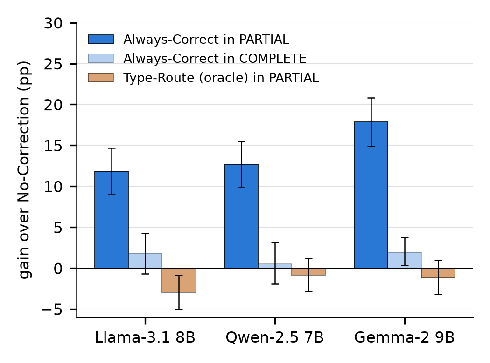

# When Does Corrective Retrieval Pay Off? An Oracle-Controlled Study of Failure Types and Retrieval State

[](https://www.python.org/)
[](https://ollama.com/)
[](https://osf.io/6mdtj)
[](#)
[](LICENSE)

This repository contains the code, question sets, retrieval corpora, per-question results and registered
analysis plan for the study:
**"When Does Corrective Retrieval Pay Off? An Oracle-Controlled Study of Failure Types and Retrieval State"** (2026).

Corrective retrieval-augmented generation (RAG) reformulates the query and retrieves again when the first
retrieval seems inadequate, and many recent systems choose the correction from a diagnosis of the failure
type (ambiguous, complex, missing evidence). End-to-end evaluations cannot tell *where* correcting helps,
or how much the diagnosis itself contributes. This study answers both questions under controlled conditions:
failure types known by construction, retrieval over corpora of 35k–83k passages, three open-weight
generators, and three hypotheses registered before the test run. It proposes no method; it complements
diagnosis-based corrective RAG by locating where correction pays off.

---

## Overview

A single, deliberately simple corrective loop is shared by every system: retrieve, inspect the top-3 passages,
optionally reformulate the query once, append the two best new passages, and answer. Paired, per-question
comparisons then isolate one decision at a time. The study evaluates:

* **Retrieval state (RQ1):** does the benefit of correcting depend on how much of the evidence chain the first
  retrieval found — none (`NONE`), part (`PARTIAL`) or all (`COMPLETE`)?
* **Failure-type labels (RQ2):** how much is a *perfect* failure-type label (`VAGUE` / `COMPLEX` /
  `INSUFFICIENT`) worth for choosing the correction, with the repair operators held fixed?
* **Realistic setting (RQ3):** what do failure labels add on a set with unanswerable questions, and how robust
  (generators, metrics) and observable (predictable from the retrieved passages) are the findings?

---

## Methodology

### Pipeline
* **Retrieval:** BM25 (`bm25s`) + BGE-M3 dense retrieval, 100 candidates each, reciprocal rank fusion (k = 60),
  top 10 re-scored by the cross-encoder `bge-reranker-v2-m3`; the generator sees the top 3 (top 5 without correction).
* **Generators:** Llama-3.1-8B-Instruct (primary), Qwen-2.5-7B-Instruct and Gemma-2-9B-Instruct, 4-bit
  (`q4_K_M`), served by Ollama, greedy decoding.
* **Corrections:** rewrite, decompose, iterative decomposition, disambiguate (anchored on the retrieved
  passages — "Always-Correct"), anchored rewrite. Each adds at most two new passages to the initial context.
* **Failure-type routing:** VAGUE → disambiguate, COMPLEX → decompose, INSUFFICIENT → anchored rewrite, with
  an oracle label (known by construction), a random label, or the generator as a self-judge.

### Data
* **Sources:** MuSiQue, HotpotQA, 2WikiMultiHopQA (multi-hop); PopQA, TriviaQA, SQuAD (single-hop);
  ASQA (ambiguous). Unanswerable questions are built by removing every corpus passage that contains the answer.
* **Test sets:** `MH.test` — 1,500 multi-hop questions (500 per source); `MIXED.test` — 1,110 questions
  (690 answerable, 150 of them ambiguous; 420 unanswerable).
* **Corpora:** 82,728 (multi-hop), 71,239 (single-hop) and 34,593 (ambiguous) passages.
* **Novelty:** none of the 18,856 questions of the exploratory pilot that suggested the hypotheses is reused.

### Protocol
* **Development → registration → test.** A development run (all systems, three generators) checked the
  pipeline and selected the type-to-action mapping of H2. The analysis plan and the SHA-256 hashes of 110
  files (code, question sets, corpora, development results) were then registered on OSF, and only then was
  the test run started. The registered analysis script was run on the test data unchanged.
* **Hypotheses:** H1 — oracle-type routing ≡ no correction on multi-hop questions (±2 pp);
  H2 — best type-to-action mapping ≡ best constant policy on the mixed set (±2 pp);
  H3 — the gain of correction is larger in `PARTIAL` than in `COMPLETE`. Holm correction over H1–H3.
* **Statistics:** paired tests (McNemar, Wilcoxon), two one-sided tests for equivalence, bootstrap intervals
  (5,000 resamples); exact match, token F1 and an LLM judge alongside substring accuracy.

---

## Results Summary

Numbers are for Llama-3.1 8B unless stated; ranges span the three generators.

* **Correction pays off where retrieval was partial (H3, confirmed).** Always-Correct gains **+11.8 to +17.9 pp**
  when the first retrieval found part of the evidence chain, and only **+0.5 to +2.0 pp** when it found all of
  it (Llama: difference +10.0 pp [+6.3, +13.8], p<sub>Holm</sub> = 6×10⁻⁷). The contrast holds in all three
  generators, after adjusting for source and question type (+13.4 pp), and under exact match, F1 and an LLM judge.
* **Anchoring matters more than the label.** In `PARTIAL`, corrections that read the retrieved passages gain
  most (disambiguate +11.8 pp, anchored rewrite +8.4 pp); rewrite and decomposition gain little or nothing.
* **A perfect failure-type label adds little to choosing the correction (H1, H2 not confirmed).** On multi-hop
  questions, oracle-type routing changes accuracy by −0.7, −0.5 and +0.2 pp; equivalence within ±2 pp holds
  for Qwen and Gemma but was not established for Llama (95% CI [−2.3, +1.0]). Its prescription,
  COMPLEX → decompose, is 8–11 pp below Always-Correct.
* **Where types vary, the label is worth about one point.** On the mixed set the best type-to-action mapping
  differs from the best constant policy by +0.8, +0.9 and +1.8 pp; chosen with hindsight on the test set
  itself (post hoc), the gap is at most **1.1 pp**. When the data choose the mapping, COMPLEX questions get an
  anchored reformulation, not decomposition.
* **Failure labels are most valuable for recognising missing evidence.** With abstention allowed, oracle
  routers by type (72.3%) and by state (72.1%) reach the utility of knowing only which questions are
  unanswerable (72.6%). Letting the generator abstain adds +19 to +23 pp of utility, more than any routing.
* **Correcting only partial retrievals is almost free of loss.** With the true state, correcting only
  `PARTIAL` questions reaches 48.6% accuracy with 1.56 LLM calls per question, against 49.6% and 2.00 calls
  for correcting everything.
* **The state is partly observable.** From the question and the top-3 passages a small classifier predicts it
  with 0.78 accuracy on multi-hop questions (question only 0.73, re-ranker scores 0.63, majority 0.41).
* **Self-judges collapse.** Prompted as a three-way judge, Llama-3.1 8B labels 1,483 of 1,500 multi-hop
  questions INSUFFICIENT; Gemma behaves similarly, Qwen spreads its labels.



*Gain over No-Correction on the 1,500 multi-hop test questions by the retrieval state of the first retrieval,
with 95% bootstrap intervals.*

---

## Repository Structure

```
failures-taxonomies/
├── config.py                   # experiment constants: models, retrieval sizes, paths
├── src/                        # pipeline: retrieval, re-ranker client, corrective loop, prompts,
│   └── ftc/                    #   judges, metrics, retrieval state; dataset loaders
├── scripts/
│   ├── build_study.py          # question selection and corpus construction
│   ├── audit_study.py          # construction audit (no LLM calls)
│   ├── run_study.py            # the systems (arms) of the study
│   ├── run_study.sh            # development / test sweeps (+ metric audit, predictability, latency)
│   ├── run_latency.sh          # uncached latency measurement
│   ├── check_retrieval_cache.py# verifies the retrieval cache changes no result
│   ├── judge_audit.py          # LLM-judge metric audit
│   ├── predictability.py       # secondary analysis: predicting the retrieval state
│   ├── analyze_study.py        # the registered analysis — computes every reported number
│   ├── freeze_osf.py           # how the plan and the hash list were frozen
│   └── rebuild_indexes.py      # rebuild BM25 / dense indexes from the passage texts
├── docs/                       # study design and the registered analysis plan
├── osf_registration/           # registered hash list, audit, set manifest, dev-run summary
├── data/
│   ├── suite/s1/               # question sets (JSONL) + manifest and audit
│   ├── corpus_s1/*/passages.jsonl   # retrieval corpora
│   ├── pilot_used_qids.json    # pilot questions excluded from every set
│   ├── predictability/         # first-retrieval features and state labels
│   └── judge_audit/            # LLM-judge verdicts on the test answers
├── results/
│   ├── raw/                    # one JSONL row per question, system and generator (dev, test, latency)
│   ├── analysis/               # output of analyze_study.py
│   └── logs/                   # run logs
└── figures/                    # figure used in this README
```

Large binaries are attached to the GitHub release; extract them at the repository root:

| asset | content |
|---|---|
| `corpus_s1_indexes.tar` | dense-embedding matrices (BGE-M3, float16) and BM25 indexes of the three corpora |
| `state_classifiers.tar` | the two DistilBERT state classifiers (question + passages; question only) |

`SHA256SUMS` lists the assets' hashes.

### Question sets

| set | composition | use |
|---|---|---|
| `MH.test` | 1,500 multi-hop (500 MuSiQue, 500 HotpotQA, 500 2WikiMultiHopQA) | H1, H3 |
| `MIXED.test` | 270 answerable single-hop, 210 unanswerable single-hop, 270 multi-hop, 210 unanswerable multi-hop, 150 ambiguous | H2 |
| `MH.dev`, `MIXED.dev` | 300 and 380 questions of the same kinds | pipeline check, H2 mapping selection |
| `STATE_TRAIN.train` | 2,890 questions (no generation) | state classifiers |

Each line holds a question, its gold answers, its passages, the failure class (`cls`) known by construction,
the gold evidence passages (`gold_pids`) and, for unanswerable questions, the construction metadata
(`exclude_hashes`: corpus passages removed at query time; `scrub_golds`: drop any retrieved candidate that
contains a gold answer).

### Result rows

`results/raw/s1_<split>/<system>__<SET>.<split>__<generator>.jsonl`, one row per question: the answer and
abstention, the metrics (`in_acc` = substring accuracy, `exact_match`, `f1`), `state_t0` (retrieval state of
the first retrieval), the diagnosis and correction (`label_t0`, `strategy_t0`), evidence coverage before and
after correction, the cost (`n_llm_calls`, tokens, latency) and the full trace (queries, passage ids and
re-ranker scores). File prefixes map to the systems of the paper:

| file prefix | system in the paper |
|---|---|
| `none_k=3`, `none_k=5` | No-Correction (top 3), No-Correction |
| `judge=constant:NONE_policy=typed` | Always-Rewrite |
| `judge=constant:COMPLEX_policy=typed` | Always-Decompose |
| `judge=constant:COMPLEX_policy=typed_iter` | Always-Iterative |
| `judge=constant:VAGUE_policy=typed` | Always-Correct (disambiguate) |
| `judge=constant:INSUFFICIENT_policy=typed` | Always-Anchored |
| `judge=oracle / random / llm_policy=typed` | Type-Route (oracle / random / self-judge) |
| `…+abstain` | the same system with abstention allowed (MIXED sets) |

---

## Reproducibility Guarantee

* **Registered before the test run.** The analysis plan (`docs/21_analysis_plan.md`) and the SHA-256 hashes
  of every input were registered on [OSF](https://osf.io/6mdtj) before any test question was generated. With
  the release assets extracted, `sha256sum -c osf_registration/frozen_files.sha256` verifies all 110 files.
* **Every number from the released rows.** `scripts/analyze_study.py` recomputes every reported number from
  `results/raw/` in minutes, without a GPU; its output is identical to `results/analysis/s1_test.json`.
* **Exact pairing.** All systems share the same first retrieval and generator at temperature 0, and every
  LLM call is cached by request, so per-question comparisons are exact and runs are resumable.
* **Audited construction.** `scripts/audit_study.py` checks, before any generation, that every evidence chain is
  in the corpus, that no answer of an unanswerable question can be retrieved, and that no question is shared
  between sets or with the pilot (`data/suite/s1/audit.json`).
* **Honest limits.** Greedy decoding of a 4-bit model is not guaranteed to be bit-identical across hardware or
  Ollama versions; the released rows are the reference for every number.

---

## Quick Start

### 1. Reproduce the numbers (no GPU)
```bash
pip install -r requirements.txt
python scripts/analyze_study.py --split test      # → results/analysis/s1_test.{json,md}
python scripts/analyze_study.py --split dev
```

### 2. Re-run the experiments (GPU)
Requires an Ollama server with `llama3.1:8b-instruct-q4_K_M`, `qwen2.5:7b-instruct-q4_K_M`,
`gemma2:9b-instruct-q4_K_M` and `bge-m3`, and a re-ranker: the local `sentence-transformers` backend
(`RERANKER_BACKEND=local`) or an HTTP service (`RERANKER_URL`). Endpoints are set in `config.py` or through
`OLLAMA_OPENAI_URL`, `OLLAMA_URL` and `RERANKER_URL`.

```bash
tar -xf corpus_s1_indexes.tar        # or: python scripts/rebuild_indexes.py
python scripts/audit_study.py
bash scripts/run_study.sh dev
bash scripts/run_study.sh test       # also runs the metric audit, predictability and latency
python scripts/analyze_study.py --split test
```

Source datasets are downloaded from the Hugging Face Hub by `src/ftc/loaders.py`. `build_study.py select`
reproduces the question selection; the corpora are released directly as `passages.jsonl`.

---

## License and data

Code: MIT (see `LICENSE`). The question sets and corpora are derived from MuSiQue, HotpotQA, 2WikiMultiHopQA,
PopQA, TriviaQA, SQuAD and ASQA and remain subject to the licences of those datasets.

---

## Citation

If you use this repository or refer to the findings, please cite:

```bib
@article{eleuterio2026correctiverag,
  title   = {When Does Corrective Retrieval Pay Off? An Oracle-Controlled Study of Failure Types and Retrieval State},
  author  = {Eleuterio, D.S. and Oliveira, P.F. and Matos, P.J.T.},
  journal = {TODO},
  year    = {2026},
}

@software{eleuterio2026correctiverag_repository,
  author  = {Eleuterio, D.S. and Oliveira, P.F. and Matos, P.J.T.},
  doi     = {TODO},
  title   = {When Does Corrective Retrieval Pay Off? An Oracle-Controlled Study of Failure Types and Retrieval State},
  url     = {TODO},
  version = {1.0.0},
  year    = {2026}
}
```
